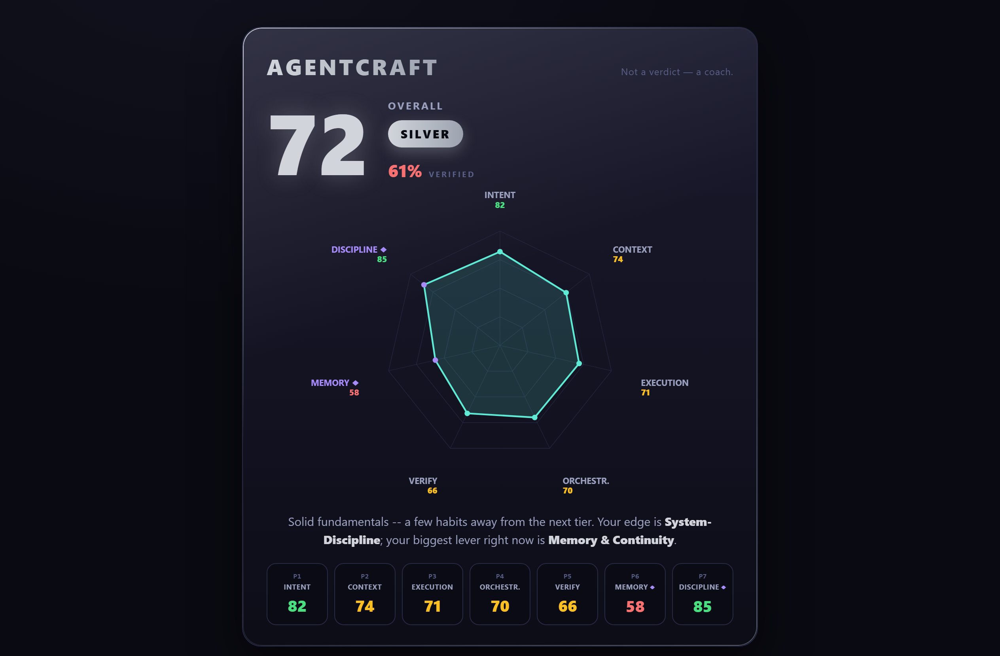

<!-- BRAND is single-sourced in SPEC.md §0 (BRAND = "AGENTCRAFT", provisional). To rename: change that one value, then `grep -ri "agentcraft" .` and sweep the handful of literals (this title, skill/agentcraft-assess/, renderer defaults, .gitignore globs, example filenames). Recipe + candidate names live in SPEC.md §0. -->

<div align="center">

# AGENTCRAFT

### A coach for how you work with AI coding agents — it reads your work, finds where you're weak, and shows you how to level up.

**Runs on your own Claude — nothing goes to any third party. Not a verdict — a coach.**

[](./LICENSE)
[](#-privacy-honest-not-hand-wavy)
[](#-privacy-honest-not-hand-wavy)
[](#-quick-start)
[](./CONTRIBUTING.md)
[](#-honest-status)

<!-- HERO CARD — a real render of the SYNTHETIC sample report (examples/sample-report-v2.agentcraft.json), produced offline by the bundled renderer. Reproduce your own from your real history via Quick start. -->


*(this is a **real render** of the bundled synthetic sample — not a mockup, and not anyone's private data. Yours renders from **your** history; see [Quick start](#-quick-start))*

</div>

---

## The origin story

A developer ran one of those "how good are you with AI agents?" assessments. The score
was fun — a shiny card, a tier, a number to screenshot. But three things nagged:

1. **It was shallow.** It graded a single chat. It couldn't see the *system* — the
   `CLAUDE.md`, the skills, the hooks, the memory files — the exact places where a
   serious builder *encodes* their discipline so they never have to re-type it.
2. **It judged, but it didn't coach.** A number tells you *where* you are. It doesn't
   tell you *how to get better by Friday.*
3. **It wanted to ship your data off your machine.** Your session history is the most
   intimate record of how you actually think and build. Uploading it to *someone else's*
   server to get a score felt backwards — a coach has to read your work, but a *stranger's*
   server doesn't.

So he built **AGENTCRAFT**: a genuine **skill-development coach** that reads your work the way a
mentor would — **what** you did, **how** you work, **where** you're weak and **why** it
costs you — and then teaches you **how to level up your OWN skill**: a transferable habit you
build in yourself (with an example pulled from your *own* history), plus a behavior to track
next scan. The prescription is always *you* getting stronger as an AI-collaborator — never a
tweak to your agents or tooling. It is **deeper** (7 pillars, including two that competing tools are blind
to), **open** (MIT), and **private the honest way**: the coach is *your own* Claude Code
agent — the same one already on your machine — so **nothing is sent to any third party**.
No MEGA, no AGENTCRAFT server, no telemetry; your work is read locally to coach you, and the
report stays on your disk.

> **Credit where it's due:** AGENTCRAFT was **inspired by [MEGA.dev](https://mega.dev)**, which
> opened this category and made scoring AI-collaboration skill a thing people care about.
> Respect. We're not here to dunk on MEGA — we're here to push the idea further, in the
> open, and keep your data on your machine. Standing on shoulders, not stepping on toes.

**v2 — the honest headline:** AGENTCRAFT v2 measures **every axis MEGA measures** (all 24 of
its traits, each **mapped**, not approximated — see the [crosswalk](#the-crosswalk-every-axis-mega-measures-mapped-plus-two-it-cant-see)),
**PLUS two axes MEGA is structurally blind to**, **PLUS** it coaches you on what to fix,
**PLUS** it runs on **your own agent with zero third-party egress**. That combined claim is only allowed to stand *because*
the crosswalk below backs it, trait by trait. It's a strict superset — kept under a
cleaner 7-axis card. v1 reports still render untouched (see [MIGRATION.md](./MIGRATION.md)).

---

## Why AGENTCRAFT is different

| | Typical single-chat scorer | **AGENTCRAFT** |
|---|---|---|
| **Breadth** | its own trait set | ✅ **every axis MEGA measures — all 24 traits, [mapped](./CROSSWALK.md)** — under 7 clean pillars |
| **Depth** | grades one conversation | **7 pillars → ~40 sub-signals** across your real workflow, each a countable partition |
| **Sees your system?** | ❌ chat only | ✅ reads `CLAUDE.md`, `.claude/skills`, hooks, gates, scripts |
| **Memory & continuity** | ❌ blind | ✅ **P6** — cross-session inheritance, learning from mistakes *(no MEGA equivalent)* |
| **System-discipline** | ❌ blind | ✅ **P7** — credits *encoded* rigor, not per-prompt re-typing *(no MEGA equivalent)* |
| **How each signal is scored** | a holistic judgment | ✅ a **falsifiable partition** — `applied + declined + missed`, `verified_outcome ≤ applied` |
| **Unfair low scores** | reads invisible behaviour low | ✅ **capability-gated** — unseeable behaviour is `unmeasured`, never a low score |
| **Outcome + efficiency** | sometimes | ✅ shown as **meta-metrics** (never faked into the grade) |
| **Coaches you?** | ❌ just a number | ✅ **growth plan** — weak / why / how / example / retest |
| **Privacy** | often uploads your data to score it | ✅ **your own Claude reads it locally — zero third-party egress** |
| **Open source** | usually closed | ✅ **MIT** |
| **API key needed** | often | ✅ **none** — your own agent is the judge |

**The fairness twist (this is the point):** a builder who *automates* their rigor into
`CLAUDE.md` + skills + hooks should score **higher**, not lower, than one who re-pastes the
same rules into every prompt. Chat-only scorers get this exactly backwards. AGENTCRAFT inverts
it — encoding discipline into the system is the *higher* skill, and AGENTCRAFT scores it as such.

---

## What it measures — the 7 pillars

Each pillar is scored **0–100** by *your own* Claude Code agent, reading your local history
plus your repo's discipline surface. Every score is **evidence-anchored** (prove, don't
declare) and good habits **count up** — correctly *declining* a bad option is a plus, not a
gotcha.

| # | Pillar | One-line: what strong looks like |
|---|--------|----------------------------------|
| **P1** | **Intent & Framing** | Clear goals, framed at the problem level, with a checkable "done when X". |
| **P2** | **Context & Grounding** | Decisions anchored to real files/logs/errors; no wasteful re-pasting. |
| **P3** | **Execution & Diagnosis** | Understand before you build; fix the root cause, not the symptom. |
| **P4** | **Orchestration** | Right call on delegate-vs-inline; clean briefs; verified integration. |
| **P5** | **Verification** | Prove it works via a *different* channel than the one that claimed it. |
| **P6** | **Memory & Continuity** 🧠 | Decisions persisted; later sessions inherit; mistakes don't repeat. |
| **P7** | **System-Discipline** ⚙️ | Rigor *encoded* in `CLAUDE.md` / skills / hooks — not re-typed each prompt. |

🧠⚙️ **P6 and P7 are the moat** — the axes single-chat scorers cannot see. They're where the
real difference between a casual user and a systems-builder shows up.

Alongside the pillars, AGENTCRAFT shows three **meta-metrics** as *context only* (never folded
into your grade, so a fast or slow style isn't punished as a skill deficit):

- **OUTCOME** — how many tasks actually reached their stated "done when X".
- **EFFICIENCY** — turns-to-outcome, rework ratio, context economy.
- **COVERAGE** — how much history the score is based on (drives a confidence hint).

**OVERALL** = weighted mean over the eligible pillars → a tier:
`85+ diamond` · `75–84 gold` · `65–74 silver` · `<65 bronze`.
Thin history? Pillars without signal are marked ineligible and *excluded* — you're never
punished for a signal a short window can't contain.

---

## The crosswalk: every axis MEGA measures, mapped (plus two it can't see)

The 7 pillars stay clean on the card, but under the hood each decomposes into **named
sub-signals — ~40 in all**. That's not decoration: it's how AGENTCRAFT v2 covers **all 24
MEGA traits**, each **mapped** to the sub-signal that watches the same behaviour (not
approximated, not dropped). Then it adds the two axes a single-chat scorer is structurally
blind to. The full receipt — trait by trait — is in **[`CROSSWALK.md`](./CROSSWALK.md)**;
here's the shape of it:

| MEGA trait | AGENTCRAFT v2 home | |
|---|---|---|
| Intent Clarity · Problem Framing · **Constraint Precision** · Falsifiable Acceptance | **P1** goal_clarity · problem_framing · `constraint_precision` ➕ · acceptance_defined | |
| Context Anchoring · Evidence Injection · **Progressive Disclosure** · Context Economy · Agent State | **P2** artifact_anchoring · evidence_at_decisions · `progressive_disclosure` ➕ · context_economy · agent_state_awareness + `session_boundary_awareness` | |
| Understanding-First · Inspect-Before-Edit · Root-Cause · **Capability Provisioning** · **Feedback Specificity** | **P3** understand_before_build · inspect_before_edit · root_cause_depth · `capability_provisioning` ➕ · `feedback_specificity` ➕ | |
| Delegation · Decomposition · Brief Quality · Parallelism · Result Integration · **Decision Rights** | **P4** delegation_judgment · decomposition · brief_quality · parallelism_hygiene · result_integration · `decision_rights` ➕ | |
| Verification Closure & Independence · **Steering & Trust Calibration** | **P5** independent_channel + closure · `steering_calibration` ➕ | |
| Durable Memory & Provenance · Recovery & Learning | **P6** decision_persistence + `rationale_recorded` · mistake_nonrepetition + `recovery_discipline` | |
| — *(MEGA is blind to these)* | **P6** `cross_session_inheritance` · **P7** `discipline_encoded` / `config_coverage` / `automation_vs_retyping` | 🛡️ **moat** |

➕ = new in v2 to cover a MEGA trait v1 had no signal for.

> **So the honest headline is:** AGENTCRAFT v2 **measures every axis MEGA measures** (all 24
> traits, mapped), **PLUS** the two MEGA-blind axes, **PLUS** it coaches, **PLUS** it's
> 100% local — a strict superset. That sentence is allowed *only because* the crosswalk
> backs it. Prove-don't-declare.

---

## How each signal is scored (the part that makes the number auditable)

AGENTCRAFT v2 doesn't score a pillar "by feel". It splits your history into **task episodes**
(one objective span each) and scores every sub-signal as a **partition** over the episodes
where the behaviour *could* apply:

```
eligible = applied + declined + missed          ← they sum exactly (a real partition)
verified_outcome ≤ applied                        ← "of the times you did X, how many were confirmed?"
```

- **applied** — you did the good behaviour.
- **declined** — you *correctly chose not to* (declined a bad option / didn't over-delegate).
  **This counts positive** — credit, not a gotcha.
- **missed** — the only negative bucket: it was warranted and absent.

The 0–100 number is then **derived from those counts** (blended onto the weak / developing
/ strong / elite band anchors), so the score is a receipt, not a vibe. `verified_outcome`
also feeds a new card stat — **% VERIFIED** — surfacing prove-don't-declare *per behaviour*.

**Two fairness/honesty guards come with it:**

- **Capability-gating.** If your Claude Code history simply *couldn't record* a behaviour
  this window (e.g. no delegation happened at all), the depending sub-signal is marked
  **`unmeasured` (`extraction-gap`)** — **never scored low**. You are not punished for a
  behaviour the harness couldn't show. (This is the exact unfairness AGENTCRAFT refuses to commit.)
- **Honest-empty, structurally.** Too few episodes to trust a rate (`< 3`)? The signal is
  **`unmeasured`** with a machine-readable reason (`no-opportunity`, `below-threshold`,
  `narrow-window`, …) — not a fabricated number. Thin history stays honest.

New in v2 too: a per-week **trend** (so the card can finally *show* your P6/P7 discipline
**compounding over weeks** — the whole thesis, made visible), plus descriptive
`practices` / `anti-patterns` synthesis. None of it is folded into your grade. Coming from
v1? Nothing breaks — see **[MIGRATION.md](./MIGRATION.md)** (v2 is a backward-tolerant superset).

---

## The coaching (the part you'll actually come back for)

AGENTCRAFT is a **skill-development coach.** For **every pillar below your target** (default: the
gold line, 75), it writes a growth card that teaches **you** a **transferable habit to build
in yourself** — a way of working that carries to every codebase, every model, every AI
session — never a tweak to your agents or tooling, never a platitude, always pinned to *your*
own evidence:

```
P3 · Build your name-the-cause reflex          (BUILD THIS HABIT)
  weak     : In several debug episodes you patched the first failing symptom
             before you'd said what actually caused it — the diagnosis instinct
             was there, but you didn't lead with it yourself.
  why      : Naming the cause before you fix is the core diagnosis muscle — it
             transfers to every codebase and every AI session you'll run. Build
             it in yourself and you stop shipping symptom-patches that regress
             and burn next session's turns.
  how      : Make it a personal reflex — your next 5 debugs, before you touch
             the file, say one sentence: "Root cause: ___" and force yourself
             to fill the blank. Only then fix. A habit, not a rule you type.
  example  : Next debug, before your edit, type to yourself: "Root cause: pool
             connection shared across coroutines." — then fix that, not the
             stack-trace line.
  retest   : Next scan — watch your OWN root_cause_depth: aim to feel yourself
             name a cause before the fix in every debug episode you run.
```

Every weak pillar becomes a **skill to develop + a personal practice you adopt + why it makes
you a stronger AI-collaborator + a behavior to track in yourself next scan.** The prescription
is self-improvement — leveling *you* up, not reconfiguring your setup. Pillars at or above
target get a one-line affirmation. It's a coach, not a critic.

---

## 🔒 Privacy: honest, not hand-wavy

Let's be precise, because a coach that *can't* read your work is useless — and a tool that
lies about who reads it doesn't deserve your trust.

**Who reads your work:** *your own* Claude Code agent — the same one already running on your
machine, over the same Anthropic channel you already use every day. A coach has to see the
work, so it does: it reads your session history and repo to tell you what you did, how you
work, and where you're weak. **That is the honest data-flow, stated plainly.**

**What keeps it bounded:** you don't hand your entire history to the model. The local
extractor (`agentcraft_extract.py` — pure Python stdlib, **zero network**) pre-digests everything
on disk and **curates a small, redacted set of representative excerpts** — the specific
episodes that drove each weak signal — so the agent deep-reads the *relevant slices*, not a
raw dump of your life. Depth without the tragedy of dumping everything.

**Where your data goes: nowhere third-party.**

- **No MEGA. No AGENTCRAFT server. No telemetry endpoint.** There is no upload step in the tool,
  and no network primitive in any shipped file. Grep it yourself — the extractor and renderer
  have **zero** `import requests`, `urllib`, `socket`, or `POST`.
- **The report stays on your disk.** The skill reads locally, reasons locally, and writes a
  **local report file.** That's the whole flow.
- **Your own agent is the judge** — no separate scoring API, no API key beyond the one your
  Claude Code already uses. There is no *other* cloud model grading you.
- **Reports are git-ignored by default** (`*.agentcraft.json`, `agentcraft-report*`, `agentcraft-card*`, plus
  `/out/` and `/reports/`) so you never accidentally commit your own analysis. The only
  fixtures that stay tracked are the hand-authored ones under `examples/` (un-ignored
  explicitly in [`.gitignore`](./.gitignore)).

**Want maximum privacy?** There's an optional **counts-only lite mode** (`--max-excerpts 0`):
the agent scores from mechanical counts alone and reads **no excerpts**. Shallower coaching,
but nothing beyond bare numbers is ever surfaced to the model. Your call, per run.

**The one thing we will *not* claim:** that "the AI never sees your data." It does — because
a coach must. What's true is narrower and honest: **it's your own Claude, reading curated
local slices to coach you, with zero egress to any third party.**

---

## 🚀 Quick start

AGENTCRAFT has two moving parts: a **skill** your agent runs, and a **renderer** that draws the card.

### 1 · Install the skill

Copy the skill folder into your Claude Code skills directory:

```bash
# macOS / Linux
cp -r skill/agentcraft-assess ~/.claude/skills/

# Windows (PowerShell)
Copy-Item -Recurse skill\agentcraft-assess "$HOME\.claude\skills\"
```

### 2 · Run the assessment

In Claude Code, in the repo you want scored, just ask:

```
Run the AGENTCRAFT assessment on my Claude Code history and this repo.
```

Your agent follows the runbook locally and writes a report file
(default: `agentcraft-report.agentcraft.json`) — schema is fixed in [`SPEC.md`](./SPEC.md).

### 3 · Render your card

```bash
# See a quick text summary first (works even before the image renderer is built):
python render/agentcraft_card.py --report agentcraft-report.agentcraft.json --summary-only

# Render the full FIFA-style card + 7-axis radar + growth-plan panel:
# (name it agentcraft-card-*.png so it's auto-git-ignored — your card is yours)
python render/agentcraft_card.py --report agentcraft-report.agentcraft.json --out agentcraft-card-me.png
```

That's it. No account, no key, no upload. **A real card renders from *your* scan** — the
hero image in this README is itself a real render of the bundled **synthetic** sample report
in [`examples/`](./examples/), not a mockup (and not anyone's private data).

### End-to-end at a glance

Three parts, one local file passed between them — the report never leaves your machine, and
nothing is sent to any third party (your own Claude does the reading + coaching):

```
  [ skill/agentcraft-assess ]  ──writes──▶  agentcraft-report.agentcraft.json  ──read by──▶  [ render/agentcraft_card.py ]
   your own agent, local        (JSON, schema = SPEC.md §7)          offline renderer → card.png (+ .html)
```

```bash
# 1. (in Claude Code) run the skill on your history + this repo → writes agentcraft-report.agentcraft.json
# 2. sanity-check the report the renderer will consume:
python render/agentcraft_card.py --report agentcraft-report.agentcraft.json --summary-only    # exit 0 = schema OK
# 3. draw the card (PNG via headless Chrome; falls back to a self-contained HTML if Chrome is absent):
python render/agentcraft_card.py --report agentcraft-report.agentcraft.json --out agentcraft-card-me.png   # auto-git-ignored
```

The report filename (`*.agentcraft.json`) is git-ignored by default, so step 1's output never gets
committed. A worked, **synthetic** example lives in [`examples/`](./examples/):
`sample-report-v2.agentcraft.json` → `hero-card.png` (the README hero) — a deterministic sample so
the renderer, docs, and tests always have something clean to point at. Reproduce it yourself:

```bash
python render/agentcraft_card.py --report examples/sample-report-v2.agentcraft.json --out my-card.png --page share
```

---

## What ships in this repo

```
agentcraft/
├── README.md                       ← you are here
├── SPEC.md                         ← canonical contract: BRAND (§0), 7 pillars, v2 schema, formula
├── RUBRIC.md                       ← agent-facing scoring rubric (sub-signal indicators + anchors)
├── CROSSWALK.md                    ← the 24-trait MEGA→AGENTCRAFT table (the superset proof)
├── MIGRATION.md                    ← v1→v2 note (backward-tolerant superset; old reports still render)
├── LICENSE                         ← MIT
├── CONTRIBUTING.md                 ← short + welcoming
├── rename.py                       ← one-command brand rename sweep (100% local)
├── agentcraft_extract.py                ← pure-stdlib streaming extractor (mandatory Step 1; emits partition counts)
├── skill/agentcraft-assess/SKILL.md     ← the assess + coach runbook (your agent runs this)
├── render/agentcraft_card.py            ← offline card renderer (reads JSON → writes HTML + PNG)
└── examples/                       ← SYNTHETIC fixtures only (no real user data ships):
    ├── sample-report.agentcraft.json    ·   synthetic v1 report (silver-72) — still valid under v2 (backward-tolerance)
    ├── sample-report-v2.agentcraft.json ·   synthetic v2 report exercising the partition / gating / trend blocks
    ├── breach-fixture.json              ·   synthetic report used to test the renderer's redaction guard
    └── hero-card.{png,html}             ·   the rendered hero card (from the synthetic v2 report above)
```

---

## The name is provisional

**AGENTCRAFT** is a working title — `agentcraft.com` / `agentcraft.io` are taken by unrelated projects,
so expect a rename. The brand is deliberately **single-sourced** in [`SPEC.md`](./SPEC.md) §0
(`BRAND = "AGENTCRAFT"`). Renaming is genuinely **one command** — a script does the whole sweep
(case-preserving content replace across ~6 mirror sites, plus renaming the skill folder and
example files):

```bash
python rename.py AGENTCRAFT --dry-run   # preview every change, touch nothing
python rename.py AGENTCRAFT             # apply the sweep
```

`rename.py` is 100% local (no network) and skips binaries + this repo's audit history. See
[`SPEC.md`](./SPEC.md) §0 for the manual recipe if you prefer to do it by hand.

Candidate replacements we're weighing (not yet applied): **AGENTCRAFT**, **PAIRSCORE**, **FORGEIQ**.
Have a better one? [Open an issue](./CONTRIBUTING.md).

---

## 🌱 Honest status

**v2. Open. Improving in public.** AGENTCRAFT does not "measure everything perfectly" — nothing
does. What it does today: a 7-pillar model that decomposes into ~40 sub-signals covering
all 24 MEGA traits (the [crosswalk](./CROSSWALK.md) is the receipt) plus two MEGA-blind
axes, an episode + partition scoring basis so each number is a countable receipt not a
vibe, capability-gating so invisible behaviour is never scored low, an evidence-anchored
local runbook, a coaching contract, and an offline renderer. It is a **backward-tolerant
superset** of v1 — old reports still render ([MIGRATION.md](./MIGRATION.md)). The drawing
code and the per-pillar reading heuristics keep being sharpened in the open. If you have a
sharper rubric, a better card layout, a MEGA trait you think isn't honestly mapped, or a
fairness edge-case we missed — [open a PR](./CONTRIBUTING.md). This gets better with every
builder who touches it.

---

## Contributing

PRs, issues, and rubric debates are genuinely welcome — see [CONTRIBUTING.md](./CONTRIBUTING.md).
Good first contributions: a new coaching example, a card-layout idea, a fairness edge-case, or
a doc fix. Be kind, be specific, prove-don't-declare.

## License

MIT — see [LICENSE](./LICENSE). © 2026 Bartlomiej Wojtyra (BW Ventures).

---

<div align="center">

**Deeper than a single chat. Open. Zero third-party egress. A coach, not a verdict.**

*Built with respect to [MEGA.dev](https://mega.dev) for opening the category.*

</div>
